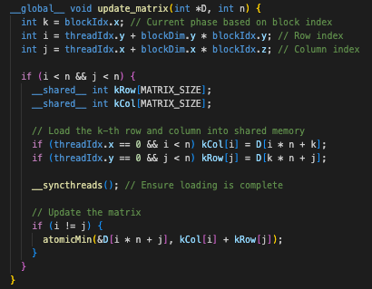
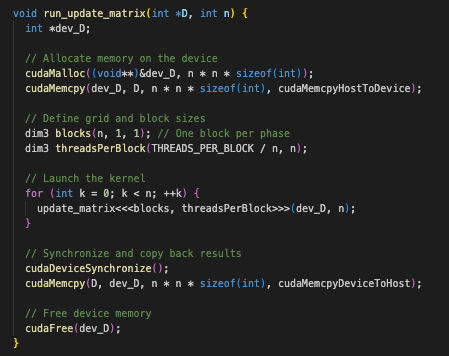
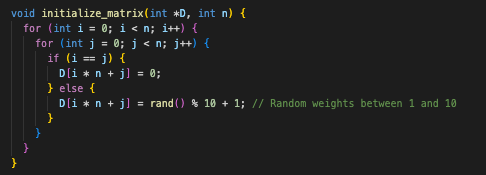
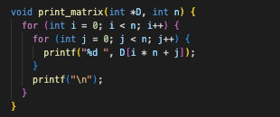
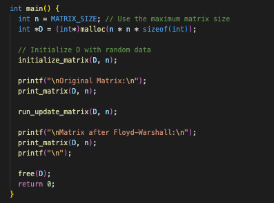
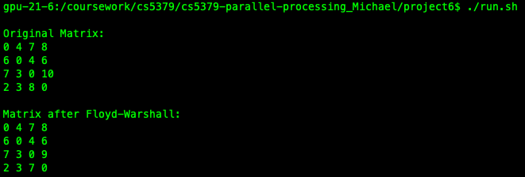

# Project 6 - Group 5
## Team Members
| Group Member              |    R#     |
|---------------------------|-----------|
| Michael Beebe             | R11772231 |
| Diego Salas Noain         | R11794236 |
| Bandar Alkhalil           | R11836831 |
| Yongjian Zhao             | R11915830 |
| Denish Otieno             | R11743138 |
| Shiva Kumar Neekishetty   | R11842757 |

## Required Software
- MPI implementation (we are using Open MPI)
- C Compiler (such as gcc or clang)
- Make
- Bash

## Instructions
### Get an interactive job on the Matador partition (HPCC) to get access to an NVIDIA V100 GPU and the NVIDIA CUDA Compiler.
```
salloc -c 1 -t 60 -p matador
```

### Compile
To change the MPI wrapper to something other than `mpicc` (such as `mpich`), edit line 1 of the Makefile. If you are using OpenMPI on the HPCC's Nocona partition, no changes to the Makefile are needed.
```
make
```

### Run
```
./run.sh
```

If you get an error saying "permission denied", run
```
chmod +x run.sh
```
then rerun `./run.sh`

### Clean Build
```
make clean
```

## Code Breakdown

All source code can be found in the `src` directory.

### Kernel Function (`__global__ void update_matrix()<<<...>>>`)
This function implements the core of the Floyd-Warshall algorithm in parallel.

- **Initialization**: 
  - `int k = blockIdx.x;`: Represents the current phase of the algorithm.
  - `int i = threadIdx.y + blockDim.y * blockIdx.y;`: Calculates the row index.
  - `int j = threadIdx.x + blockDim.x * blockIdx.z;`: Calculates the column index.

- **Boundary Check**: 
  - Ensures that the computation is within the matrix limits.

- **Shared Memory Allocation**:
  - `__shared__ int kRow[MATRIX_SIZE];`
  - `__shared__ int kCol[MATRIX_SIZE];`
  - Stores the k-th row and column of the matrix for quick access.

- **Data Loading into Shared Memory**:
  - Loads the k-th row and column to reduce global memory access.

- **Synchronization**: 
  - `__syncthreads();`: Ensures all threads have loaded data into shared memory.

- **Matrix Update**:
  - Updates the matrix if a shorter path is found through vertex `k`.



### Function (`void run_update_matrix()`)
Handles the execution and management of the CUDA kernel.

- **Device Memory Allocation**: 
  - Allocates memory for the matrix on the GPU.

- **Data Transfer**: 
  - Copies matrix data from the host to the device.

- **Kernel Configuration and Launch**:
  - Configures grid and block dimensions.
  - Launches the kernel for each phase `k`.

- **Synchronization and Data Retrieval**:
  - Waits for GPU operations to complete.
  - Copies the updated matrix back to the host.

- **Memory Deallocation**: 
  - Frees GPU memory.



### Matrix Initialization Function (`void initialize_matrix()`)
Initializes the matrix with random weights.

- **Random Weight Assignment**: 
  - Non-diagonal elements get random weights.
  - Diagonal elements are set to zero.



### Matrix Printing Function (`void print_matrix()`)
Displays the matrix.

- **Formatted Output**: 
  - Prints the matrix elements row by row.



### Main Function (`int main()`)
Manages the overall execution flow.

- **Memory Allocation and Initialization**: 
  - Allocates memory for the matrix.
  - Initializes the matrix with random data.

- **Processing and Display**:
  - Executes the Floyd-Warshall algorithm on the GPU.
  - Displays the matrix before and after processing.

- **Resource Cleanup**: 
  - Frees allocated memory.



## Output

